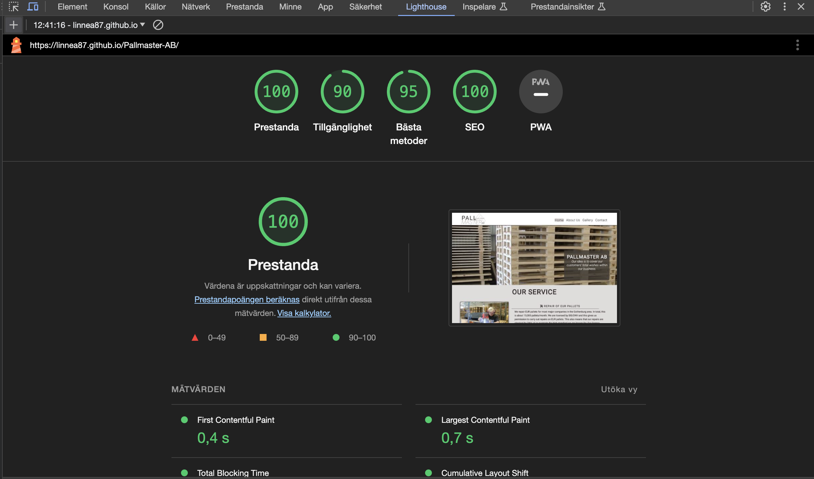

# Pallmaster AB

This website is intended to provide comprehensive information about the company Pallmaster AB. As a new and existing customer, you get to take part in the company's history, who runs the company now, what service the company offers and how you get in touch with the company. As a customer, you also get to see pictures of some of the company's various products.

## Planning

### Goals

As Owner of the website I want;

* To deliver an inviting website where you easy can find information about the company and their services.

* Provide background information about the company.

* Encourage customers to contact the company and purchase their services.

The business owner will;

* Create an online presentation about their company.

* Inform both existing and new customers about their services.

* Giv Information about their location.

* Provide a method to get in touch with them.

 The User Experience;

* It should be easy to navigate between the different pages and get back to the start page with one click.

* It should be easy to see which page you are on.

* It should be easy to go back to the navigation menu when you are at the bottom of the page.

* You should be able to see the website and read its information on different screen sizes.

* See pictures throughout the website especially on the production.

 I want the Users;

* To find the company's location and contact information.

* Find information about the company.

* Read about the company's services.

* Find out what the differences is about Pallmaster´s company and services compared to others.  

## Design

### wierframes

I created wierframes from balsamic to visualize what I wanted the finished design to look like. I started creating wierframes for
 mobile devices first because I wanted to stick with the mobile-first approach, then I created wierframes for tablet and computer screen sizes.

### The index page

During the process I changed the design on the index page as I thought that the one I drew/planned didn't turn out well in reality.

### About Us page

### Gallery page

### Contact page

### Color

When it came to choosing colors for the website, I wanted the colors to go in the beige/brown direction, which creates a red thread to the website's content. To achieve this I used <https://coolors.co> to create these "wood colors".

## Header
Here the company's logo is presented and we get to see part of the company's production in the picture.

-The header also contains the navigation bar code.
-The basic styling and code has been used from the [Love Running](https://github.com/Code-Institute-Solutions/love-running-2.0-sourcecode/tree/main/04-creating-the-club-ethos/05-club-ethos-icons) project..

## Navigation Bar

The navigation can be found at the top right of the logo with links to four different pages. The menu is  constructed with two differents effect;

-A hover effect to show which button you have the mouse over, and a active affect ho
-And an active effect in the form of a line that shows which page you are on

All pages have the same consistent theme, which makes it easy to see that only the content changes on the page you are on. The menu also makes it easy to navigate back and forth on the pages without having to click the back button.

## Main-Our Service

* Here you can read about what services the company provides
* The text contains information about the service the company provides.
* The text also tells which laws the company complies with.
* The headings and paragraph are styled the same throughout the page to create a common thread.
* Image is used  to create a inviting index page.

## The footer

Here you find;

* Links to other companies that pallmaster cooperates with
* Link to pallmaster AB phone number
* A google map to find the companys location
* All links opens in a new window.

## Pages and Features

### Favicon

* Used an icon from [Icon 8](https://icons8.com/icons)
* Favicon was created through [Favicon Converter](https://favicon.io/favicon-converter/)
* The same favicon is used throughout every single page to make it easier for the user to recognize the website if they have other tabs open.

### About Us

* This page is for the user to be able to read more detailed information about the Company, susch as their historia, how runs the company and about the Company today. 
* Images are used to give a more relaxed visual impression and for the user to get a face on the owner.

### Gallery

The gallery contain images in a responsive design. the purpose of the gallery is to show the user the company's various productions and to attract customers to want to hire the company.

### Contact form

* The Contact page is intended to give the user an opportunity to send an email with questions or concerns to the company.
* Simple and direct design.
*Contains first name, last name, email and a textarea.
* All fields are required.
* When submitted the user will be sent to a different page stating the message has been received.

## Deployment

### SETTING IT UP

I used Code Institute's instructional video on how to deploy my website. I paused the video and followed the instructions. Text and steps below are copied from Code Institutes instructions on how to deploy the site to GitHub.

The site was deployed to GitHub pages. The steps to deploy are as follows:

1. In the GitHub repository, navigate to the Settings tab
2. From the source section drop-down menu, select the Master Branch
3. Once the master branch has been selected, the page will be automatically     refreshed with a detailed ribbon display to indicate the successful deployment.
4. The live link can be found here - <https://linnea87.github.io/Pallmaster-AB/>

### Adding, committing and pushing code

* All code has been pushed to the repository https://github.com/Linnea87/Pallmaster-AB
* All code has been regurlary added, committed and pushed throughout the project.
* The commands being used are `git add <file>`,
  `git commit -m “commit message”` and
  `git push`
* Due to being completely brand new into this tech world, the `git commit -m “commit message”` have gradually improved throughout this project. I found it was difficult for me to understand the importance of good logging in the beginning and how to accomplish that.

## Testing

* Manually tested all navigation links on every page.
* Manually tested opening the site in different browsers.
* Tested to skip filling in the contact form - submit button did not work until I filled in the information properly, hence the 'required' attribute is working.
* Came to the page 'submit.html' when filling in Contact Form and clicking on Submit.
* Gallery - all images are showing and gallery is flexible depending on screen size.

### Bugs

* Had minor problems with positioning of different elements due to rookie mistakes. solved it with [W3Schools](https://w3schools.com).
* HTML Validator showed 1 error regarding a div. Easily fixed by deleating that div.
* had minor problems to align the text and the google map in the footer, used google and [W3Schools](https://w3schools.com) to so solve this

## Unfixed Bugs

* Have some Errors in the index.html page when i run W3C validator this beacus some dublicate of id tags. Did not have time to troubleshoot them due to submission but will look into them the next update. b

* Lighthouse issues such as to big images.  Did not have time to troubleshoot them due to submission but will look into them the next update.

## Validator Testing

### HTML - W3C validator

No errors were returned when passing through the official [W3C validator] https://github.com/Linnea87/Pallmaster-AB on the Gallery.html, contact,html and about-us.html the second time.

Have Errors in index.html [W3C validator] https://github.com/Linnea87/Pallmaster-AB Did not have time to troubleshoot them due to submission but will look into them the next update.

### CSS - Jigsaw Validator

### Lighthouse
- Received score 100/90.
- Had some warnings and errors.

### WAVE
Site has been tested at [Wave](https://wave.webaim.org/report#/https://rackstorm.github.io/Code-Institute_Project-1/)
The only alert was that there is a
redundant link to the header.
*2 errors because there are missing two form labels

## Technologies

* HTML is the main language of this project. CSS for styling in a separate file.
* The IDE used has been Codeanywhere with Code Institutes template.
* Git has been used to regularly adding, committing and pushing code to GitHub.
* All code and assets have been stored at GitHub.
* The project has been deployed through Git Pages.
* Favicon Generator has been used for the Favicons.
* Icon8 has been used for downloading the free favicon image.
* Wireframes have been designed in Balsamiq.

## Credits

1. All informative text about the company [old pallmasterAb.com](http://www.pallmaster.com/index.html)

2. The images are from and a [PallmasterAB.com](http://www.pallmaster.com/index.html) and some are taken by my self

3. CSS styling of headings, paragraphs comes from the [Love Running project](https://github.com/Code-Institute-Solutions/love-running-2.0-sourcecode), as does the hero image code.

4. Code for [gallery](https://www.w3schools.com/css/css_image_gallery.asp) and [nav bar](https://www.w3schools.com/css/css_navbar.asp) were taken from W3schools with own modification.

5. Images for the gallery were taken from [old pallmasterAb.com](http://www.pallmaster.com/index.html)
6. The icons in the footer were taken from [Font Awesome](https://fontawesome.com).
7. The font was taken from Font Awesome. [Font Awesome](https://fontawesome.com)
8. Styling of the [contact form](https://www.w3schools.com/css/css_form.asp) has been inspired by W3School
